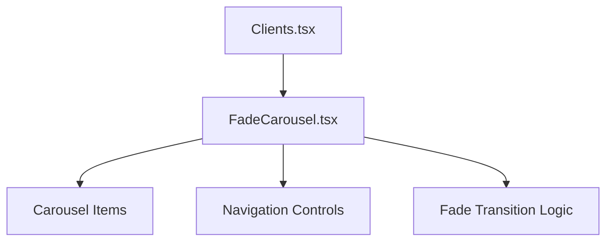

# Client Logos Carousel Implementation Plan

## Requirements
- Display all logos from `public/logos/` directory
- Fade transition effect between slides
- Manual navigation only (previous/next buttons)
- Responsive design

## Technical Approach

### 1. New Fade Carousel Component
Create a new carousel component that:
- Uses CSS transitions for fade effects
- Implements manual navigation controls
- Dynamically loads all images from the public/logos directory
- Supports responsive design

### 2. Component Structure


### 3. Implementation Details

#### Fade Transition Logic
- Use CSS opacity transitions for fade effects
- Implement a timer-based system for manual advancement
- Maintain current slide index state

#### Logo Loading
- Dynamically import all images from `public/logos/` directory
- Extract logo names for display purposes
- Handle different image formats (png, svg)

#### Navigation
- Previous/Next buttons for manual control
- No autoplay functionality
- Visual indicators for current slide position

## Integration with Existing Code

### Current Clients.tsx Structure
```tsx
<section id="clients" className="py-16 md:py-24">
  <div className="container mx-auto">
    <header className="max-w-2xl mb-10">
      <h2 className="font-display text-3xl md:text-4xl font-semibold">{t("clients.header")}</h2>
      <p className="mt-3 text-muted-foreground">{t("clients.sub")}</p>
    </header>
    <div className="grid grid-cols-2 sm:grid-cols-3 md:grid-cols-4 lg:grid-cols-6 gap-6">
      {items.map((c) => (
        <article key={c.name} className="rounded-lg border bg-card/50 p-4 flex flex-col items-center justify-center text-center">
          
          <span className="mt-3 text-sm text-muted-foreground">{c.name}</span>
        </article>
      ))}
    </div>
  </div>
</section>
```

### Proposed Changes
1. Replace the grid layout with the new FadeCarousel component
2. Dynamically load logos instead of using i18n data
3. Implement fade transitions and manual navigation

## File Structure
```
src/
  components/
    sections/
      Clients.tsx          # Modified to use FadeCarousel
      FadeCarousel.tsx     # New component for fade transitions
```

## Implementation Steps
1. Create FadeCarousel.tsx component with fade transition logic
2. Implement dynamic logo loading from public/logos directory
3. Add manual navigation controls
4. Modify Clients.tsx to use the new component
5. Test with all available logos
6. Ensure responsive design works correctly